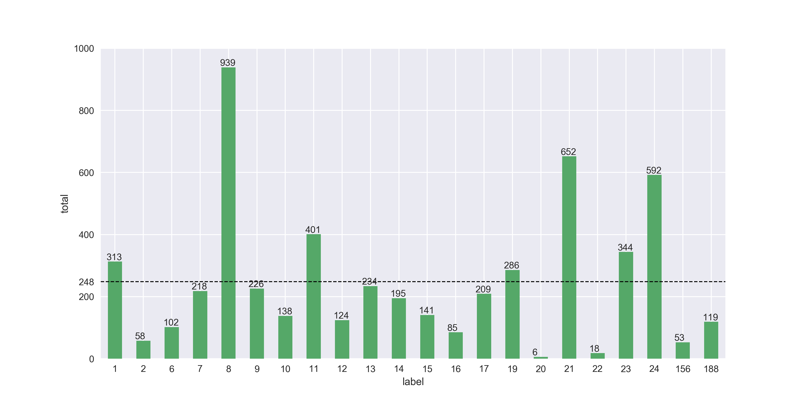
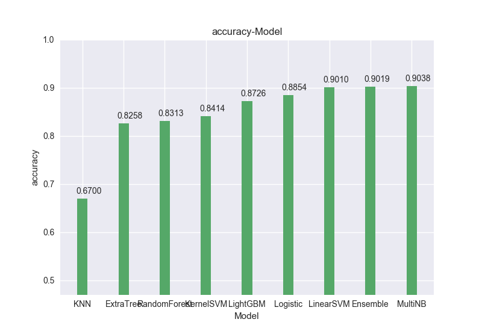
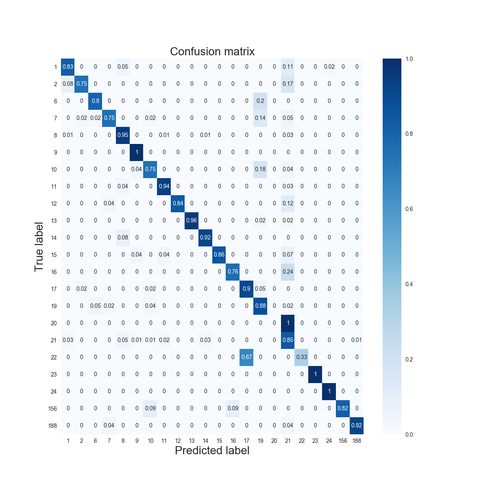
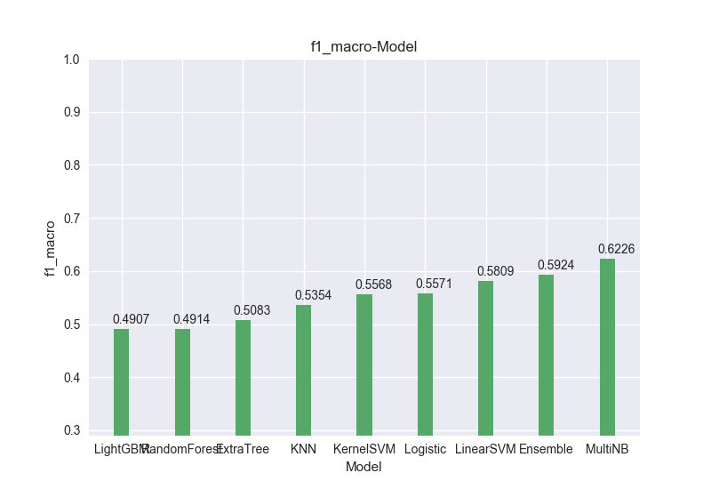
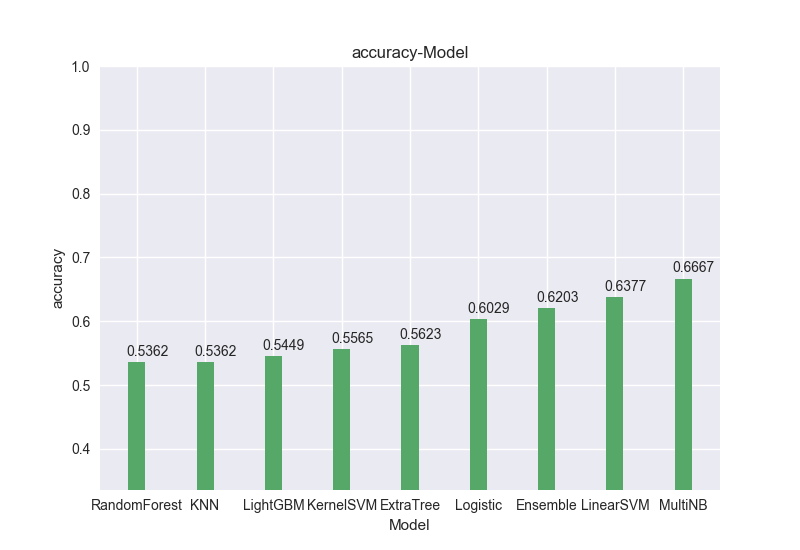
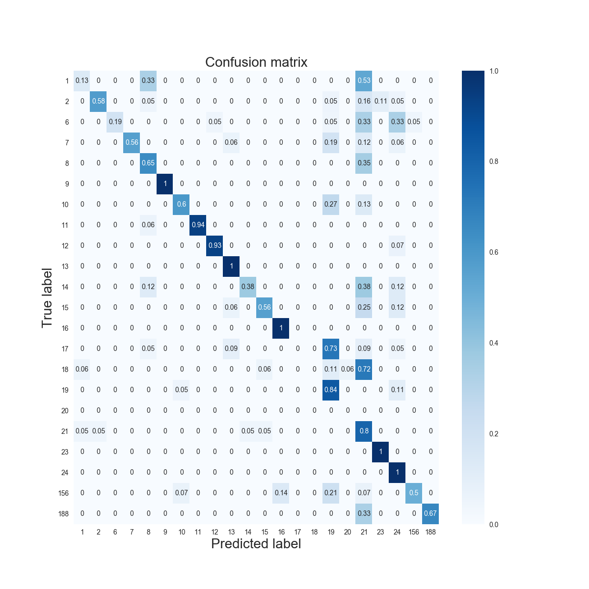

Bài toán Text Classification
============================
# 1. Xác định bài toán
## Đề bài
* Input: Tập các văn bản và thể loại tương ứng của mỗi văn bản
* Output: Với mỗi văn bản mới cần xác định thể loại của văn bản đó
## Kiểu bài toán
* Đây là bài toán multi-class classification

# 2. Khám phá dữ liệu
* Đây là văn bản tiếng việt => Cần có kĩ thuật **tách từ** dành cho tiếng việt
* Phân bố các class trong tập dữ liệu huấn luyện (gồm 5453 văn bản và 22 chủ đề)
 
> Đây là bài toán **imbalanced class** => Cần resampling dữ liệu và thêm trọng số class khi train model

# 3. Giải quyết bài toán
# 3.1. Tiền xử lý
# 3.1.1. Làm sạch dữ liệu
* Nhận xét: trong dữ liệu training có 1 số kí tự Hàn Quốc, nhiều từ tiếng Việt viết liền (thiếu dấu cách) và thiếu dấu, có 1 số từ tiếng Anh
* Các bước làm sạch dữ liệu:
    * Chỉ giữ lại các kí từ chữ cái và khoảng trắng (loại bỏ các kí tự số và kí tự khác)
    * Tách từ theo dấu khoảng trắng và loại bỏ stopword (tiếng Anh)
    * Loại bỏ những từ quá ngắn (độ dài < 2) và những từ quá dài (độ dài > 20). Những từ quá dài chủ yếu là do thiếu dấu cách và 1 số link, nhưng do có link dài đến 74 kí tự khiến thư viện tách từ tiếng Việt không thực hiện được trong thời gian chấp nhận nên cần phải loại bỏ các từ quá dài. Ngưỡng này có thể cần điều chỉnh để tăng hiệu quả của thuật toán.
# 3.1.2. Tách từ tiếng Việt
* Sử dụng thư viện [pyvi](https://github.com/trungtv/pyvi) để tách từ

# 3.1.3. Biểu diễn văn bản
* Xây dựng từ điển
    * Sau khi tách từ tiếng Việt thì loại bỏ các từ xuất hiện ít hơn 3 lần và số chủ đề mà từ đó xuất hiện nhiều hơn 50% số chủ đề (tức là loại bỏ các từ xuất hiện trong nhiều hơn 11 chủ đề)
    * Loại bỏ stopword tiếng Việt
    * Từ điền thu được: [vocabulary](./Vocabulary/vocab_17012.csv) gồm 17012 từ

* Sử dụng Tf-Idf để biểu diễn một văn bản dưới dạng vector có số chiều bằng kích thước từ điển

# 3.1.4. Resampling dataset
* Tách tập dữ liệu input (5453 văn bản) thành tập train (4362 văn bản) và tập validation (1091 văn bản) (tỉ lệ 80%-20% và 2 tập dữ liệu mới này có **cùng phân bố class**)
* Do tập dữ liệu là imbalanced class nên cần phải **resampling** trên tập train mới:
    * Over sampling bằng SMOTE (chỉ over sampling những class có số văn bản < số văn bản trung bình của mỗi class)
    * Under sampling bằng Cluster Centroid sau khi đã over sampling (chỉ under sampling những class có số văn bản > số văn bản trung bình)
    * Phân bố class trước khi resampling (4362 văn bản)
     
    * Phân bố class sau khi resampling (văn bản)
    

# 3.2. Huấn luyện
* Xác định độ đo metric đánh giá hiệu năng mô hình: **f1-macro** (do đây là bài toán imbalanced class)
* Sử dụng một vài mô hình classification kết hợp với hyper-parameter tuning (dùng grid và random search chọn ra tham số đạt hiệu năng tốt nhất đo bằng cross-validation trên tập train). Sau đó dùng major voting để đưa ra kết quả cuối cùng và dùng tập validation để chọn ra các mô hình nào mà kết quả của major-voting đưa ra là tốt nhất trên tập validation
* Sau khi xác định được các bộ tham số tốt thì train lại toàn bộ các mô hình với các tham số này trên toàn bộ dữ liệu ban đầu gồm (5453 văn bản)
* Các mô hình sử dụng và tham số:
    1. Multinomial Naive Bayes: alpha = 0.005
    2. Random Forest:
    
    |Hyper-parameter|Value|
    |---------------|-----|
    |max_features   |0.8  |
    |n_estimators   |20   |
    |max_depth      |80   |
    
    3. Extra Tree
    
    |Hyper-parameter|Value|
    |---------------|-----|
    |max_features   |0.3  |
    |n_estimators   |50   |
    |max_depth      |70   |
    |class_weight   |"balanced"|
    
    4. LightGMB
    
    |Hyper-parameter|Value|
    |---------------|-----|
    |learning_rate  |0.2  |
    |n_estimators   |50   |
    |max_depth      |50   |
    
    5. Linear SVM: C = 1.43
    6. Kernel SVM: C = 0.7, gamma = 0.4
    7. Logistic Regression: C = 1.83
    8. KNN: n_neighbors = 9, weights = "distance"
    
    
# 4. Kết quả thực nghiệm
* Kết quả trên tập validation (đây là cách kết hợp các mô hình đạt hiệu năng tốt nhất trên tập validation)
    * Tóm tắt kết quả:
    
    |Metric|Score|
    |------|-----|
    |f1-macro|0.8312|
    |accuracy|0.9038|
    |precision-macro|0.8730|
    |recall-macro|0.8093|
    
    * f1-macro:

    * Accuracy:

    * Confusion matrix

    * Các độ đo khác và confusion matrix của từng model: [đánh giá model trên tập validation](./Images_Readme/Evaluation_Validation)
    
* Kết quả trên tập test (345 văn bản)
    * Tóm tắt kết quả:
    
    |Metric|Score|
    |------|-----|
    |f1-macro|0.5924|
    |accuracy|0.6203|
    |precision-macro|0.6768|
    |recall-macro|0.6060|
    
    * f1-macro:

    * Accuracy:

    * Confusion matrix

    * Các độ đo khác và confusion matrix của từng model: [đánh giá model trên tập test](./Images_Readme/Evaluation_Test)
    
# 5. Nhận xét

* Kết quả trên tập test kém hơn rất nhiều so với kết quả trên tập validation
    * Có thể do kích thước tập test chưa đủ lớn để đánh giá chính xác
    * Phân bố của các class trong tập train ban đầu (5453 văn bản) và tập test có sự chênh lệch
    
    > Label 20 và 22 là minority label (sau đó được over sampling khá nhiều để tránh imbalanced class) nhưng lại *không* xuất hiện trong tập test. Trong tập test lại xuất hiện label 18 *chưa từng gặp* trong tập train !!!
    * Có thể dữ liệu trong tập train không tổng quát hóa được dữ liệu trên tập test

* Một số hướng mở rộng
    * Thay vì *cứng nhắc* sử dụng major voting có thể thử nghiệm dùng phương pháp stacking
    * Sử dụng Deep Learning (mạng LSTM)

## 6. Hướng dẫn sử dụng
* Predict
    * Thay đổi 2 biến sau để dự đoán file test (2 biến này ở ngay sau dòng "if \__name__ == '\__main__'")
        * test_data_path: đường dẫn file cần dự đoán
        * model_dir: thư mục chứa model đã train
    * Kết quả được lưu ở đường dẫn có dạng: "predicted_data_{0}_{1}.(csv|txt)", trong đó
        * {0}: số văn bản trong tập test
        * {1}: thời gian lúc dự đoán
        * Có 2 file csv, txt ở 2 dạng output khác nhau nhưng kết quả dự đoán là giống nhau
* Evaluate
    * Điều chỉnh 2 biến giống như khi predict
    * Kết quả đánh giá được lưu trong thư mục Evaluate trong thư mục của model đó
* Best model hiện tại lưu trong "./Model/2018-08-14_23-08-53"